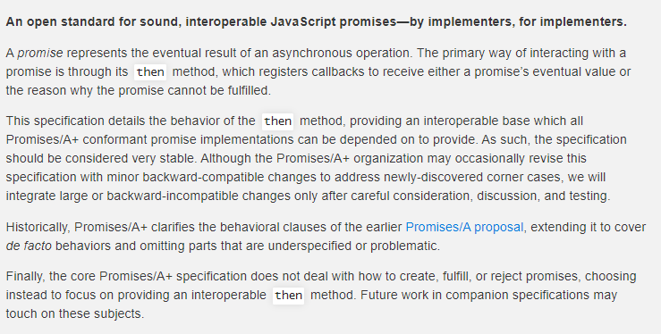
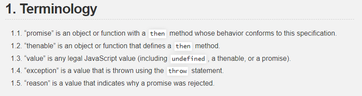
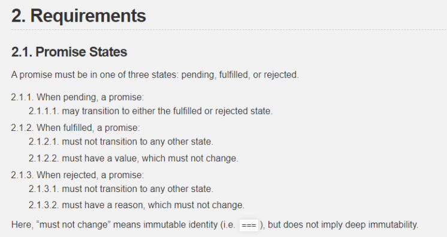
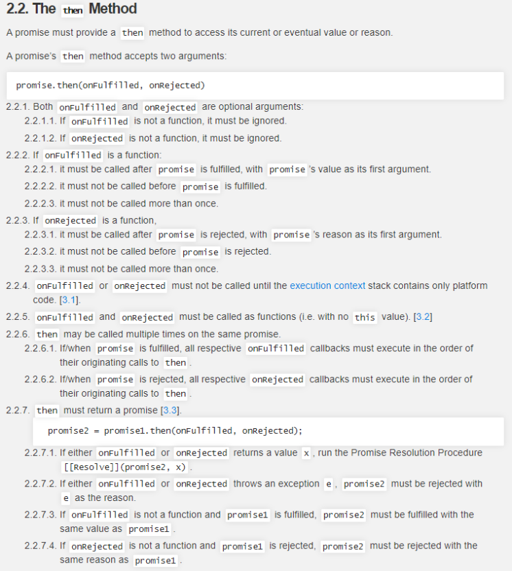
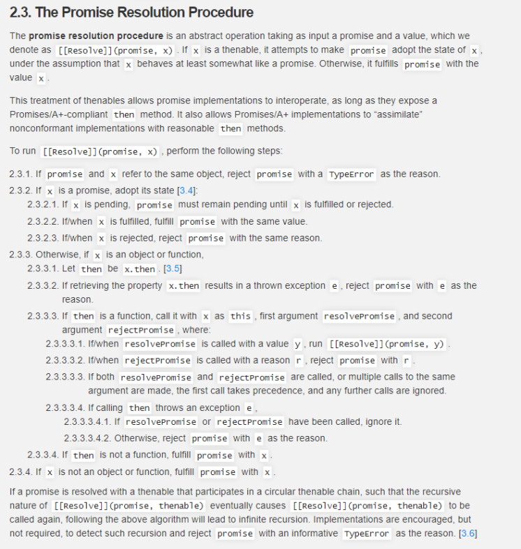
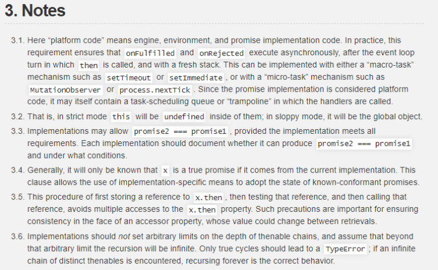
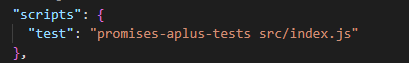

# Promise/A+规范翻译以及具体实现

<br />_promise _表示一个异步操作的实际结果，与 `promise` 交互的主要手段是 `then`  方法，该方法注册回调会接收一个 `promise` 的最终值或者 `promise` 被拒绝的理由/原因。<br />该规范详细描述了 `then` 方法的行为，提供了一个可操作交互的基础，所有符合 `promise/A+` 规范的 `promise` 都可以依靠该基础来实现。因此这个规范被认为是非常稳定的，尽管 `promise/A+` 组织可能偶尔地通过一些较小的向后兼容的改变修订规范，来解决新发现的一些边界情况。但是，只有在经过仔细的考虑、讨论和测试后，我们才会集成大的或者向后不兼容的更改。<br />过去， `promise/A+` 阐明了早期的 `promise/A+提案` 的行为条款，扩展了原有规范约定俗成的行为（_de facto：_实际上存在的（不一定合法））, 并且省略了没有被指明或者有问题的部分。<br />最终， `promise/A+` 规范没有处理如何创建、满足或者拒绝 `promises` ，而是选择去专注于提供一个可以操作的 `then` 方法。在相关规范的进一步的工作中可能会提及到这些话题。<br />

<a name="8b2a2019"></a>

# 1.术语



- promise 是一个包含 `then` 方法的对象或者函数，该方法符合规范指定的行为。
- thenable 是一个定义了 `then` 方法的对象或者函数。
- value 是任意合法的 Javascript 值（包括 `undefined` ， `thenable`， `promise`）。
- exception 是一个由 `throw` 语句抛出的值。
- reason 是一个解释了为何 promise 被拒绝的值。


<a name="aqnCn"></a>

# 2.必要条件

<a name="FpmX6"></a>

## 2.1. promise 状态



- `promise` 必须是以下三种状态值的其中一种：pending, fulfilled, 或者rejected。
- 当 `promise` 状态是 pending 时，可以转换为 fulfilled 或者 rejected。
- 当 `promise` 状态是 `fulfilled/rejected` 时，不能转换为其他值，并且必须包含一个不可变的 `value/reason`。
- 在这里的 "**一定不可变**" 代表的是值的引用相同，而不是引用中的每个值相同。

<br />
<a name="hak2j"></a>

## 2.2. then方法



- promise 必须提供 `then` 方法来访问当前或最终的值或原因。
- promise `then` 方法接受2个参数， `promise.then(onFulfilled, onRejected)`.
- `onFulfilled`，`onRejected` 都是可选参数，并且传入值不是函数则会被忽略。
- 如果 `onFulfilled/onRejected` 是一个函数，则它必须在 `promise` 状态转换为 `fulfilled/rejected` 后调用，promise `value/reason` 是该函数的第一个参数。并且不能多次调用。
- `onFulfilled/onRejected` 直到执行上下文栈仅包括平台代码时才可以被调用。 [[3.1](#YSujD)]
- `onFulfilled/onRejected` 必须作为函数被调用（即没有 this）[[3.2](#jYSj1)]
- `then` 方法法在同一个 `promise` 中可能会被多次调用，当 `promise` 状态为 `fulfilled/rejected` 时, 所有 `onFulfilled/onRejected` 回调函数必须按照原始顺序执行。
- `then` 方法必须返回一个 `promise`。[[3.3](#8PrFr)]

```javascript
promise2 = promise1.then(onFulfilled, onRejected)
```

- 如果 `onFulfilled/onRejected` 返回了一个值 `x`，则执行 promise 解决程序 `[[Resolve]](promise2, x)` 。
- 如果 `onFulfilled/onRejected` 抛出一个异常 `e`，promise2 必须使用 `e` 作为 reason 将状态转换为 rejected。
- 如果 `onFulfilled/onRejected` 不是一个函数，并且 promise1 状态为 `fulfilled/rejected`，promise2 必须使用一样的 `value/reason` 将状态转换为 `fulfilled/rejected`。

<br />
<a name="yXRJh"></a>

## 2.3. promise解决程序



-  promise 解决程序是一个抽象操作，将 `promise` 和 `value` 作为输入，可以视为 `[[Resolve]](promise, x)`。如果 `x` 是一个 **thenable**,它会尝试让 `promise` 采用 `x` 的状态，并假设 `x` 的行为至少在某种程度上类似`promise` ，否则将使用 `x` 作为执行 `promise` 的值进行处理。
-  这种 `thenable` 的特性使得 `Promise` 的实现更具有通用性：只要它们暴露了一个符合 `promise/A+` 规范的 `then` 方法。这同时也使得遵循 `promise/A+` 规范的实现可以与那些不太规范的实现能共存。
-  要运行 `[[Resolve]](promise, x)` , 需要执行以下步骤。
   1. 如果 `promise` 和 `x` 引用了一样的对象，使用一个 `TypeError` 作为拒绝 `promise` 的理由。
   2. 如果 `x` 是一个 `promise` ，采用它的状态。[[3.4](#03quG)]
      1. 如果 `x` 在pending状态， `promise` 必须保持为pending直到 `x` 转变为 `fulfilled/rejected` 。
      1. 如果 `x` 是 `fulfilled/rejected` ， `promise` 使用一样的 `value/reason` 来转换为对应的 `fulfilled/rejected` 。
   3. 如果 `x` 是一个对象或者函数。
      1. 让 `then` 变为 `x.then` ，即 `then = x.then` 。[[3.5](#HjctT)]
      2. 如果检索属性 `x.then` 时抛出一个异常 `e` ,则使用 `e` 作为理由拒绝 `promise` 。
      3. 如果 `then` 是一个函数，用 `x` 作为 `this` 调用它。`then` 方法的参数为两个回调函数`resolvePromise/rejectPromise` 。
         1. 如果 `resolvePromise` 用一个值 `y` 调用，运行 `[[Resolve]](promise, y)`。
         1. 如果 `rejectPromise` 用一个原因 `r` 调用，用 `r` 拒绝 `promise`。
         1. 如果 `resolvePromise/rejectPromise` 都被调用，或者对同一个参数进行多次调用，那么第一次调用优先，以后的调用都会被忽略。
         1. 如果调用 `then` 抛出了一个异常 `e` 。
            1. 如果 `resolvePromise/rejectPromise` 已经被调用，忽略它。
            1. 否则，用 `e` 作为拒绝 `promise` 的理由。
      4. 如果 `then` 不是一个函数，用 `x` 作为执行 `promise` 的值。
   4. 如果 `x` 不是一个对象或者函数。用 `x` 作为执行 `promise` 的值。
-  如果 `promise` 用一个循环的 `thenable` 链解决， 由于 `[[Resolve]](promise, thenalbe)` 的递归特性，最终将导致 `[[Resolve]](promise, thenable)` 被再次调用，遵循上面的算法会导致无限递归。规范中

并没有要求强制处理，但是鼓励实现者检测递归并且用一个具有丰富信息的 `TypeError` 拒绝 `promise` 。[[3.6](#mHK3h)]
<a name="P4Tyy"></a>

# 3.注释


<a name="YSujD"></a>

###### 1. "平台代码"指的是引擎，环境，以及 `promise` 实现代码。实际上，这个要求确保了 `onFulfilled/onRejected` 异步执行， 并且应该在 `then` 方法被调用的那一轮事件循环之后用新的执行栈执行。 具体实现可以使用宏任务机制（setTimeout、setImmediate）或者微任务机制(MutationObserver、process.nextTick)。由于 `promise` 实现被视为平台代码，所以在自身处理程序被调用时可能已经包含一个任务调度队列。

<a name="jYSj1"></a>

###### 2. 在 `strict` 严格模式下，`this` 在他们内部将指向 `undefined`，在 `sloppy` 非严格模式下将指向全局对象。

<a name="8PrFr"></a>

###### 3. 假如实现满足所有需求，可以允许 `promise2 === promise1`。每一个实现都应该记录是否能够产生 `promise2 === promise1`以及什么情况下会出现 `promise2 === promise1`。

<a name="03quG"></a>

###### 4. 通常，只有 `x` 来自于当前实现，才知道它是一个真正的 `promise`。这条规则允许那些特例实现采用符合已知要求的 `promise` 的状态。

<a name="HjctT"></a>

###### 5. 这个程序首先存储了 `x.then` 的引用，然后再测试这个引用，再然后进行调用这个引用，避免了多次访问 `x.then` 属性，这种预防措施对于确保访问者属性的一致性非常重要，因为访问者属性的值可能在两次检索中改变。

<a name="mHK3h"></a>

###### 6. 实现不应该在 `thenable` 链的深度上做任意限制，并且假设超过了那个任意限制将会无限递归。只有真正的循环调用才应该引发一个 `TypeError` ; 如果遇到了一个明确的截然不同的无限调用链，那么无限执行下去才是正确的行为。


<a name="gIi6y"></a>

# 4.实现规范

<a name="O0I1V"></a>

## 4.1 前期工作

通过 npm install promises-aplus-tests ，可以下载测试套件。<br /><br />修改脚本命令后通过 npm run test 运行测试套件。<br />编写一些工具函数。

```javascript
const isFunction = obj => typeof obj === 'function'
const isObject = obj => !!(obj && typeof obj === 'object')
const isThenable = obj => (isFunction(obj) || isObject(obj)) && 'then' in obj
const isPromise = promise => promise instanceof Promise
```

<br />
<a name="8PiG1"></a>

## 4.2 定义状态部分代码

首先定义三个状态常量、 `promise` 构造函数，其中 `result` 作为 `value/reason` 看待、一个 `transition` 状态迁移函数，它只会在 `state` 为 `PENDING` 时，进行状态迁移。<br />其中** deferred **方法是用与测试套件要求提供的，无实际意义，可忽略。

```javascript
const PENDING = 'pending';
const FULFILLED = 'fulfilled';
const REJECTED = 'rejected';

function Promise() {
  this.state = PENDING;
  this.result = null;
}

const transition = (promise, state, result) => {
  if (promise.state !== PENDING) {
    return
  }
  promise.state = state
  promise.result = result
}

Promise.deferred = () => {
  const dfd = {}
  dfd.promise = new Promise((resolve, reject) => {
    dfd.resolve = resolve
    dfd.reject = reject
  })
  return dfd
}

module.exports = Promise
```


<a name="JEf6i"></a>

## 4.3 定义 then 方法

`then` 方法可以被调用很多次，为了记录注册的回调顺序，我们为 `promise` 新增一个 `callbacks` 参数存储回调顺序。<br />实现方法 `then` ，包含2个函数，如果当前状态为 `PENDING` 则将注册的回调push至 `callbacks` ，否则使用宏任务 `setTimeout` 进行异步调用。<br />实现 `handleCallback` 方法，该方法用于具体执行 `onFulfilled/onRejected` ，其中会对是否是函数进行判断，若是函数则执行对应的函数，若不是函数直接使用 `result` 作为 `promise` 的值。

```javascript
function Promise() {
  this.state = PENDING;
  this.result = null;
  this.callbacks = [];
}

Promise.prototype.then = function(onFulfilled, onRejected) {
  return new Promise((resolve, reject) => {
    let callback = { onFulfilled, onRejected, resolve, reject }

    if (this.state === PENDING) {
      this.callbacks.push(callback)
    } else {
      setTimeout(() => handleCallback(callback, this.state, this.result), 0)
    }
  })
}

const handleCallback = (callback, state, result) => {
  let { onFulfilled, onRejected, resolve, reject } = callback
  try {
    if (state === FULFILLED) {
      isFunction(onFulfilled) ? resolve(onFulfilled(result)) : resolve(result)
    } else if (state === REJECTED) {
      isFunction(onRejected) ? resolve(onRejected(result)) : reject(result)
    }
  } catch (error) {
    reject(error)
  }
}
```


<a name="sLdkd"></a>

## 4.4 promise解决程序

按照[必要条件中的promise解决程序](#yXRJh)说明，一步一步的进行处理。<br />第一步，如果 result 是当前 promise 本身，就抛出 TypeError 错误<br />第二步，如果 result 是另一个 promise，那么沿用它的 state 和 result 状态。<br />第三步，如果 result 是一个 thenable 对象。先取 then 函数，再 call then 函数，重新进入 **promise解决程序** 过程。<br />最后，如果不是上述情况，这个 result 成为当前 promise 的 result。

```javascript
const resolvePromise = (promise, result, resolve, reject) => {
  if (result === promise) {
    const reason = new TypeError('Can not fulfill promise with itself')
    return reject(reason)
  }

  if (isPromise(result)) {
    return result.then(resolve, reject)
  }

  if (isThenable(result)) {
    try {
      const then = result.then
      if (isFunction(then)) {
        return new Promise(then.bind(result)).then(resolve, reject)
      }
    } catch (error) {
      reject(error)
    }
  }

  resolve(result)
}
```

<a name="aUi0u"></a>

## 4.5 整合补齐

为 `promise` 构造函数补充入参 `f` ，其中 `f` 为一个接收 `resolve, reject` 2个参数的函数。<br />构造 `onFulfilled/onRejected` 函数切换至对应的状态。<br />构造 `resolve/reject` 函数，其中 `resolve` 使用 **promise解决程序 **对 value 进行验证。<br />规范中表明了 `resolve, reject` 只能调用一次，于是我们设置一个 flag 名为 `ignore` 确保这2个函数只调用1次。<br />补充 `transition` 实现，状态变更时异步清空所有 `callbacks` 。

```javascript
function Promise(f) {
  this.state = PENDING
  this.result = null
  this.callbacks = []

  const onFulfilled = value => transition(this, FULFILLED, value)
  const onRejected = reason => transition(this, REJECTED, reason)

  let ignore = false

  const resolve = value => {
    if (ignore) {
      return
    }
    ignore = true
    resolvePromise(this, value, onFulfilled, onRejected)
  }

  const reject = reason => {
    if (ignore) {
      return
    }
    ignore = true
    onRejected(reason)
  }

  try {
    f(resolve, reject)
  } catch (error) {
    reject(error)
  }
}

const transition = (promise, state, result) => {
  if (promise.state !== PENDING) {
    return
  }
  promise.state = state
  promise.result = result
  setTimeout(() => handleCallbacks(promise.callbacks, state, result), 0)
}

const handleCallbacks = (callbacks, state, result) => {
  while (callbacks.length) {
    handleCallback(callbacks.shift(), state, result)
  }
}
```

<a name="gxGw4"></a>

## 4.6 测试

运行npm run test<br /><br />大功告成！
<a name="tCVgD"></a>
# 5.ES6 Promise API实现

```javascript
Promise.resolve = result => {
  if (result instanceof Promise) {
    return result
  }
  return new Promise((resolve) => resolve(result))
}

Promise.reject = reason => {
  return new Promise((resolve, reject) => {
    reject(reason)
  })
}

Promise.all = promiseList => {
  const resPromise = new Promise((resolve, reject) => {
    let count = 0
    const result = []
    const length = promiseList.length

    if (length === 0) {
      return resolve(result)
    }

    promiseList.forEach((promise, index) => {
      Promise.resolve(promise).then(value => {
        count++
        result[index] = value
        if (count === length) {
          resolve(result)
        }
      }, reason => reject(reason))
    })
  })

  return resPromise
}

Promise.race = promiseList => {
  const resPromise = new Promise((resolve, reject) => {
    const length = promiseList.length

    if (length === 0) {
      return resolve(result)
    } else {
      promiseList.forEach(promise => {
        Promise.resolve(promise).then(value => resolve(value), reason => reject(reason))
      })
    }
  })

  return resPromise
}

Promise.prototype.catch = function (onRejected) {
  this.then(null, onRejected)
}

Promise.prototype.finally = function (fn) {
  return this.then(value => Promise.resolve(fn()).then(() => value),
    reason => Promise.resolve(fn()).then(() => {
      throw reason
    }))
}

Promise.allSettled = promiseList => {
  return new Promise(resolve => {
    let count = 0
    const result = []
    const length = promiseList.length

    if (length === 0) {
      return resolve(result)
    } else {
      promiseList.forEach((promise, index) => {
        Promise.resolve(promise).then(value => {
          count++
          result[index] = {
            value,
            status: 'fulfilled',
          }
          if (count === length) {
            return resolve(result)
          }
        }, reason => {
          count++
          result[index] = {
            reason,
            status: 'rejected',
          }
          if (count === length) {
            return resolve(result)
          }
        })
      })
    }
  })
}
```

<a name="tCVgD"></a>
# 参考文章：

[原文：promise/A+规范](https://promisesaplus.com/)<br />[CSDN[衣乌安、]: 你该知道的promise（1）：Promise/A+规范中英文对照翻译](https://zsy-x.blog.csdn.net/article/details/108714782)<br />[知乎作者[夏日]：[译]Promise/A+ 规范](https://zhuanlan.zhihu.com/p/143204897)<br />[知乎作者[工业聚]: 100 行代码实现 Promises/A+ 规范](https://zhuanlan.zhihu.com/p/83965949)<br />

